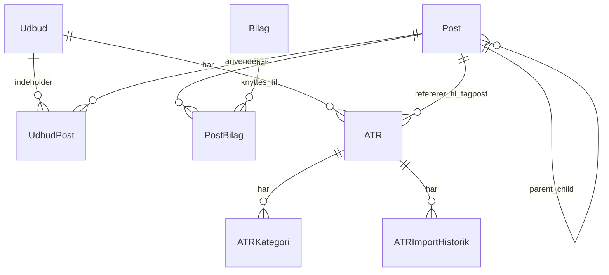

# PRD: BaneByg Teknisk Rådgivning — SharePoint-kloning

## 1. Formål & Kontekst
- Platformen bruges til at oprette og vedligeholde udbudsmateriale for teknisk rådgivning samt tilhørende ATR- og bemandingsarbejde.
- Forsiden beskriver fire hovedsektioner: `Poster`, `Udbud`, `ATR & Bemanding` og `Bilag`.
- Løsningen kører i dag på et SharePoint-site under `banedanmarkonline.sharepoint.com`, men med en tydeligt specialbygget applikationsoplevelse.
- Formålet med kloningen er en 1:1 funktionel SharePoint-baseret reproduktion af den observerede løsning, inklusive hierarkiske poster, udbudseditor, ATR-forløb, bilagsstyring og administrationslag.
- Alt der ikke kan bekræftes direkte i videoen, markeres som `[ANTAGELSE]`.

## 2. Sitemap & Navigation

### 2.1 Sidehierarki

```text
Forside / Raadgiver.aspx
├─ Poster
│  ├─ Post-hierarki
│  └─ Post-detalje/editor
├─ Udbud
│  ├─ Udbudsoversigt
│  ├─ Nyt udbud modal
│  ├─ Rediger udbud modal
│  ├─ Udbud arbejdsflade / post-editor
│  └─ Hent basistekst-dialog
├─ ATR & Bemanding
│  ├─ ATR-oversigt
│  ├─ ATR Info modal
│  └─ ATR-skema / timenedbrudsside
├─ Bilag
│  ├─ Bilagsoversigt
│  ├─ Opret bilag modal
│  ├─ Overfør fil-side/systemdialog
│  └─ Rediger bilag modal
├─ Admin
│  └─ Dropdown/sider ikke åbnet i videoen
├─ Feedback & Forespørgsler
│  └─ Mål-side ikke vist i videoen
└─ Footer-links
   ├─ Kontaktinformation
   ├─ Guide til Ejer
   ├─ Guide til Bruger
   ├─ Guide til ATR & Bemanding
   └─ Adgangsstyring
```

### 2.2 Navigationstyper

| Niveau | Element | Navigationstype | Observation |
|---|---|---|---|
| Topniveau | `Poster`, `Udbud`, `ATR & Bemanding`, `Bilag` | Vandret tab-navigation | Synlig på forside og undersider |
| Sekundær højre navigation | `Feedback & Forespørgsler`, `Eksempeludtræk`, `Admin` | Link + dropdown | Synlig i top-højre område |
| Indholdsniveau | Poster | Venstre trænavigation + højre editor | Hierarkisk katalog |
| Indholdsniveau | Udbud/ATR/Bilag | Datatabeller med handlingskolonner | Filtrering, søgning og handlingsikoner |
| Overlay | Formularer og dialoger | Modal | Nyt/rediger udbud, ATR Info, bilag |
| Sekundær arbejdsside | ATR-skema | Fuld side | Egen formularside med `Tilbage` |

### 2.3 Observerede URL- og routingmønstre
- Forsiden vises under et mønster som `.../sites/ANL12308/SitePages/Raadgiver.aspx?...`.
- Et bilag åbnes via direkte SharePoint-fil-URL, fx `/sites/ANL12308/Bilag/Bilag 8 Timeliste (Skabelon).xlsx`.
- `Link til projekt site` i udbudsformularen indikerer, at et udbud kan knyttes til et separat projektsite.
- Der er ikke påvist client-side SPA-routing i optagelsen. `[ANTAGELSE]` Sektionerne skiftes via state eller querystring på samme SharePoint-side.

## 3. Skærmbeskrivelser

### Forside
- **URL/sti:** `.../SitePages/Raadgiver.aspx?...`
- **Formål:** Introduktion til BBTR og adgang til de fire hovedsektioner.
- **Layout:** Enkeltkolonne-indhold under global navigation og footer i to spalter.
- **Komponenter:**

| Komponent | Type | Placering | Adfærd |
|---|---|---|---|
| Titel `Banebyg Teknisk Rådgivning` | Sideoverskrift | Top center | Statisk |
| Primære tabs | Tab-navigation | Under header | Skifter sektion |
| Højre utility-links | Link/dropdown | Top-højre | Hjælpe- og adminfunktioner |
| Introtekst | Rich text | Midterindhold | Beskriver de fire sektioner |
| Bemærkning om adgang | Fremhævet tekst | Midterindhold | `Poster` og `Bilag` kun for administratorer |
| Footer linkblok | Linkliste | Nederst | Viser vejledninger |

- **Data vist:** Forklaring af platformen, sektioner og adgangsnoter.
- **Brugerhandlinger:** Gå til sektioner, åbne vejledninger, åbne admin og eksempeludtræk.
- **Screenshot-reference:** `Video 2: 00:00`

### Poster
- **URL/sti:** `Poster`-sektion.
- **Formål:** Administrere postkataloget, som danner grundlag for rådgiverudbud og ATR-krav.
- **Layout:** Todelt layout med posttræ til venstre og detaljeeditor til højre.
- **Komponenter:**

| Komponent | Type | Placering | Adfærd |
|---|---|---|---|
| `Søg post` | Søgefelt | Øverst venstre | Søger i postkataloget |
| `Søg kun i postnr./titel` | Checkbox | Ved søgning | Begrænser søgeområde |
| `+ Opret ny post` | Primær knap | Øverst højre | Opretter ny post |
| Posttræ | Trænavigation | Venstre panel | Ekspanderbare noder med indrykning |
| Aktiv/Udgået-toggle | Toggle | Højre panel | Markeringsstatus |
| `Version` | Visningsfelt | Højre panel | Viser versionsnummer |
| `Post type` | Dropdown | Højre panel | Fx `Fagpost`, `Hovedpost`, `Post` |
| `Fagpost`, `Hovedpost`, `Nr.`, `Navn` | Inputs/lookups | Højre panel | Relation og identitet |
| `Beskrivelse` | Rich text editor | Højre panel | Standardtekst |
| `Bilag` + `Tilføj bilag` | Liste + knap | Højre panel | Knytter bilag til posten |
| Adfærdsflag | Checkboxgruppe | Nederst | Styrer udbud/ATR-adfærd |
| `Gem ændringer` / `Annuller` | Knapper | Footer | Gem/fortryd |

- **Data vist:** Stort hierarki med bl.a. `1 Generelle ydelser`, `2 Banebyg`, `3 Spor`, `12 Konstruktioner`, `19 Banebyg`, `20 Generelle ydelser`, `22 Programfasen`, `23 Projekteringsfase`, `24 Udførelsesfase`, `25 Afslutningsfase` samt mange `UDGÅET`-poster.
- **Brugerhandlinger:** Søge, redigere postmetadata, aktivere/udfase poster, styre bilag og særlige flag for udbudsspecifik tekst og ATR.
- **Screenshot-reference:** `Video 2: 00:24`, `00:39`, `00:44`, `00:54`, `00:59`, `05:14`, `05:19`

### Nyt/Rediger udbud modal
- **URL/sti:** Modal oven på `Udbud`.
- **Formål:** Oprette og vedligeholde et rådgiverudbuds stamdata.
- **Layout:** Vertikal formular med hovedfelter øverst og delingssektion nederst.
- **Komponenter:**

| Komponent | Type | Placering | Adfærd |
|---|---|---|---|
| `Projektnr.*` | Input | Øverst | Påkrævet |
| `Projektnavn*` | Input | Øverst | Påkrævet |
| `Beskrivelse` | Multilinje input | Midt | Valgfri beskrivelse |
| `Offentliggørelsesdato *` | Dato-input | Midt | Påkrævet |
| `Status *` | Dropdown | Midt | Påkrævet |
| `Fase *` | Dropdown | Midt | Påkrævet |
| `Link til projekt site` | URL-input + infoikon | Midt | SharePoint-projektsite |
| `Eksterne rådgivere` | Delingsfelt | Nederst | Deling til eksterne |
| `Fremhæv udbud for` | Delingsfelt | Nederst | Fremhævelse/målgruppe |
| `Nyt udbud` / `Gem ændringer` | Primær knap | Footer | Opret/gem |
| `Annuller` | Sekundær knap | Footer | Lukker modal |

- **Data vist:** Fx projektnr. `001`, projektnavn `Skabelon`, status `Aktiv`, fase `Detail`.
- **Brugerhandlinger:** Oprette/redigere udbud og vælge fase.
- **Screenshot-reference:** `Video 2: 01:19`, `01:24`, `01:29`

### Udbudsoversigt
- **URL/sti:** `Udbud`-sektion.
- **Formål:** Liste alle rådgiverudbud og give adgang til redigering, preview, udtræk, kommentarer og bilag.
- **Layout:** Filterlinje over en bred tabel.
- **Komponenter:**

| Komponent | Type | Placering | Adfærd |
|---|---|---|---|
| Filter dropdown | Dropdown | Øverst venstre | `Mine aktive udbud` observeret |
| Søgefelt | Input | Øverst | Søger på projektnavn eller nr. |
| Årsvælger | Dropdown | Øverst | Filtrerer på år |
| `+ Nyt udbud` | Primær knap | Øverst højre | Åbner modal |
| Udbudstabel | Datatabel | Hovedindhold | Viser række pr. udbud |
| Handlingskolonner | Ikoner/links | Flere kolonner | Rediger, tilføj/rediger, preview, udtræk, kommentarer, bilag |
| Lock-ikon | Statusikon | Række | Indikerer lås |

- **Data vist:** `Projektnummer- og navn`, `Revision`, `Beskrivelse`, `Offentliggørelsesdato`, `Status`, `Version` samt handlingskolonner.
- **Brugerhandlinger:** Filtrere, søge, oprette udbud, redigere metadata, åbne udbudsposter, se preview/udtræk, åbne kommentarer og bilag.
- **Screenshot-reference:** `Video 2: 01:09`, `01:14`, `01:34`

### Udbud arbejdsflade / post-editor
- **URL/sti:** Åbnes via `Tilføj/rediger ...` på en udbudsrække.
- **Formål:** Sammenstille udbuddet ved at vælge standardposter, tilføje lokal tekst, kommentere og vedhæfte bilag.
- **Layout:** Venstre søgning og hierarki, centerkolonne med postvalg/tekst og højre kommentarspor.
- **Komponenter:**

| Komponent | Type | Placering | Adfærd |
|---|---|---|---|
| `Udbud: [navn]` | Overskrift | Øverst | Angiver aktivt udbud |
| `Søg udbudspost` | Søgefelt | Øverst | Søger i postkataloget for udbuddet |
| Filter `Alle` | Dropdown | Øverst højre | Filtrerer viste poster |
| Hierarkiske postrækker | Træliste | Venstre/midt | Ekspanderbare med checkbox |
| Versionsbadge `(v.X)` | Badge/tekst | På rækker | Viser basisversion |
| `Se/hent basistekst fra nyeste version` | Link/knap | På rækker | Åbner dialog |
| Blyantikon | Handlingsikon | På rækker | Redigering |
| `Låst af ...` | Statusbadge | Redigeringstilstand | Viser lås |
| `Gem` / `Annuller` | Knapper | Redigeringstilstand | Gem/fortryd |
| `Tilføj udbudsspecifik post` | Knap | Redigeringstilstand | Tilføjer lokal post |
| `Udbudsspecifik kommentar` | Rich text editor | Højre panel | Kommentar til valgt post |
| `Vedhæft bilag` | Link/knap | Højre panel | Vedhæfter fil |
| Kommentarbobler | Ikoner | Højre kolonne | Viser antal kommentarer |

- **Data vist:** Poster som `1 Generelle ydelser`, `2 Banebyg`, `3 Spor`, underliggende poster som `3.1 Banedanmark grundlag`, `3.3 Dispensationsansøgninger` mv.
- **Brugerhandlinger:** Vælge/fravælge poster, redigere lokal tekst, hente ny basistekst, kommentere, vedhæfte bilag og gemme.
- **Screenshot-reference:** `Video 2: 02:09`, `02:14`, `02:19`, `02:24`, `02:29`, `02:34`

### Hent basistekst fra nyeste version dialog
- **URL/sti:** Modal oven på udbudsarbejdsfladen.
- **Formål:** Lade brugeren hente en nyere standardtekst/version ind i udbuddet.
- **Layout:** Kompakt modal med informationsliste og handlingsknapper.
- **Komponenter:**

| Komponent | Type | Placering | Adfærd |
|---|---|---|---|
| Dialogtitel `Hent basistekst fra nyeste version` | Overskrift | Modal header | Statisk |
| Liste over basistekstindhold | Tekstblok | Modal body | Viser hvilke dokumenter/tekster der følger med |
| `Hent basistekst fra nyeste version` | Primær knap | Modal footer | Bekræfter import |
| `Annuller` | Sekundær knap | Modal footer | Lukker uden ændring |

- **Data vist:** Referencer til indhold som `Common Safety Method – Risk Assessment (CSM-RA ...)`, `Opdateret dispensationsliste (XLSX)` og `Dispensationer (pdf og docx)`.
- **Brugerhandlinger:** Bekræfte eller afvise indlæsning af nyeste basistekst.
- **Screenshot-reference:** `Video 2: 01:49`, `02:09`

### ATR & Bemanding oversigt
- **URL/sti:** `ATR & Bemanding`-sektion.
- **Formål:** Liste ATR-poster pr. udbud/kontrakt og give adgang til ATR-info, ATR-skema, preview og importhistorik.
- **Layout:** Filterlinje over en grupperet datatabel.
- **Komponenter:**

| Komponent | Type | Placering | Adfærd |
|---|---|---|---|
| Filter `Se mine ATR'er` | Dropdown | Øverst venstre | Begrænser visning |
| `Søg på udbud eller ATR-nr.` | Søgefelt | Øverst | Søgning |
| `Vælg år` | Dropdown | Øverst | Årsfilter |
| ATR-tabel | Datatabel | Hovedindhold | Grupperet efter udbud |
| Expand/collapse på gruppe | Ikon | Venstre i gruppe | Åbner/lukker ATR-rækker |
| `Rediger ATR info` | Handlingsikon | Kolonne | Åbner modal |
| `Udfyld ATR-skema` | Handlingsikon | Kolonne | Åbner ATR-skema-side |
| `Preview ATR` | Handlingsikon | Kolonne | Preview af ATR |
| `Preview Bemandingsplan` | Handlingsikon | Kolonne | Preview af bemandingsplan |
| `Import hist` | Link `Vis` | Kolonne | Viser importhistorik |

- **Data vist:** `ATR navn- og nummer`, `Kontrakt navn- og nummer`, `Udbud - Fagpost`, `Start`, `Slut`, `Status`, `Version`.
- **Brugerhandlinger:** Filtrere ATR'er, åbne ATR-info, udfylde ATR-skema, se previews og importhistorik.
- **Screenshot-reference:** `Video 2: 02:54`, `03:19`, `03:24`, `03:29`, `04:44`

### ATR Info modal
- **URL/sti:** Modal åbnet fra `Rediger ATR info`.
- **Formål:** Vedligeholde ATR'ens metadata, kontraktinformation, datoer og godkendelsesroller.
- **Layout:** Lang formular i modal med felter i to niveauer.
- **Komponenter:**

| Komponent | Type | Placering | Adfærd |
|---|---|---|---|
| `Revisionsnr.` | Input | Øverst | Versions-/revisionsfelt |
| `Ydelsen` | Input/dropdown `[ANTAGELSE]` | Øverst | Navn/ydelse |
| `Status *` | Dropdown | Øverst | Påkrævet |
| `ATR nummer` | Input | Øverst | ATR-identitet |
| `Kontrakt *` | Dropdown/input | Øverst | Påkrævet |
| `Kontrakt-nr.` | Input | Øverst | Kontraktnummer |
| `Start dato *` | Dato-input | Midt | Påkrævet |
| `Estimeret slut dato *` | Dato-input | Midt | Påkrævet |
| `Udbudsform` | Input/dropdown | Nederst | Kontrakt-/anskaffelsesform |
| `Ændringsydelse` | Toggle | Nederst | Observeret `Nej` |
| `Loft` | Tal/input | Nederst | Budget/ramme |
| `BDK Projektleder` | Personfelt | Nederst | Intern rolle |
| `BDK Ledelsesrepræsentant` | Personfelt | Nederst | Intern rolle |
| `Godkendt af` | Personfelt | Nederst | Godkender |
| `Rådgiver repræsentant` | Personfelt | Nederst | Ekstern rolle |
| `Eksterne rådgivere` | Person-/gruppefelt | Nederst | Deltagere |
| `Gem ændringer` / `Annuller` | Knapper | Footer | Gem/fortryd |

- **Data vist:** ATR-metadata og personer/roller.
- **Brugerhandlinger:** Angive ATR-data, kontraktforhold og godkendelsesansvar.
- **Screenshot-reference:** `Video 2: 02:59`, `03:34`, `03:39`

### ATR-skema / timenedbrud
- **URL/sti:** Egen arbejdsside åbnet fra `Udfyld ATR-skema`.
- **Formål:** Udfylde ATR-tekst og opbygge kategorier/timenedbrud til bemandingsplan.
- **Layout:** Formular i venstre/midt og højresidepanel for `Nedbrud af timeforbrug`.
- **Komponenter:**

| Komponent | Type | Placering | Adfærd |
|---|---|---|---|
| `Tilbage` | Link/knap | Øverst venstre | Returnerer til ATR-oversigt |
| Projekt/ATR-header | Overskrift + metadata | Øverst | Viser udbud, fagpost og datoer |
| `Gem` | Primær knap | Øverst | Gemmer ATR-skema |
| Advarselsbanner | Alert | Øverst i formular | Visning når datoer mangler |
| `Overordnet beskrivelse` | Rich text/input | Formular | Beskrivelse af ydelse |
| `Omfang af ydelsen` | Rich text/input | Formular | Scope |
| `Ressourcer` | Rich text/input | Formular | Ressourcebeskrivelse |
| `Kategorier` | Repeater | Formular | Dynamiske kategorirækker |
| `+ Tilføj kategori` | Knap | Under kategorier | Tilføjer række |
| Slet-ikon på kategori | Handlingsikon | Ved række | Fjerner kategori |
| `Importer timenedbrud` | Knap | Øverst højre | Import af timenedbrud |
| `Nedbrud af timeforbrug` | Sidepanel | Højre | Viser breakdown-område |

- **Data vist:** ATR-navn, fagpostnummer, datoer og skemafelter.
- **Brugerhandlinger:** Skrive ATR-tekst, tilføje kategorier, importere timenedbrud og gemme.
- **Screenshot-reference:** `Video 2: 03:54`, `03:59`, `04:04`, `04:09`, `04:14`, `04:19`, `04:24`, `04:29`

### Bilagsoversigt
- **URL/sti:** `Bilag`-sektion.
- **Formål:** Vedligeholde fælles bilagsskabeloner og dokumenter for BBTR.
- **Layout:** Søgning og tabel med metadata og redigeringskolonne.
- **Komponenter:**

| Komponent | Type | Placering | Adfærd |
|---|---|---|---|
| `Søg på bilag` | Søgefelt | Øverst | Filnavnssøgning |
| `+ Tilføj bilag` | Primær knap | Øverst højre | Opretter nyt bilag |
| Bilagstabel | Datatabel | Hovedindhold | Viser bilagskatalog |
| Kolonnefiltre | Filterfelter | Under headers | Filtrering |
| Rediger-ikon | Handlingsikon | Kolonne `Rediger` | Åbner redigeringsmodal |

- **Data vist:** `Id`, `Navn`, `Version`, `Aktiv`, `Bilag relateret til poster`, `Rediger`.
- **Brugerhandlinger:** Søge, oprette, redigere og aktivere/deaktivere bilag.
- **Screenshot-reference:** `Video 2: 04:49`, `04:59`, `05:04`

### Opret bilag modal og filoverførsel
- **URL/sti:** Modal + SharePoint uploadside/systemdialog.
- **Formål:** Oprette nyt bilag og uploade tilhørende fil.
- **Layout:** Først systemdialog for filvalg, derefter modal med bilagsmetadata.
- **Komponenter:**

| Komponent | Type | Placering | Adfærd |
|---|---|---|---|
| `Overfør fil` | Systemdialog/side | Mellemtrin | Vælg lokal fil |
| `Vælg fil` | Uploadkontrol | Dialog | Åbner filvælger |
| `Uploade` / `Annullere` | Knapper | Dialog | Bekræft/afbryd upload |
| `Vælg bilag` | Filfelt/lookup | Modal | Viser valgt fil |
| `Upload fil` | Knap | Modal | Tilføjer fil |
| `Aktiv` | Toggle | Modal | Sætter aktivstatus |
| `Opret bilag` | Primær knap | Modal footer | Opretter bilag |
| `Annuller` | Sekundær knap | Modal footer | Lukker modal |

- **Data vist:** Filnavn og aktiv-flag.
- **Brugerhandlinger:** Uploade ny fil og oprette bilagspost.
- **Screenshot-reference:** `Video 2: 04:54`

### Rediger bilag modal
- **URL/sti:** Modal åbnet fra bilagsoversigten.
- **Formål:** Redigere navn, fil og aktivstatus for et bilag.
- **Layout:** Kort formularmodal med få felter.
- **Komponenter:**

| Komponent | Type | Placering | Adfærd |
|---|---|---|---|
| `Navn` | Input | Øverst | Redigerer vist bilagsnavn |
| `Upload fil` | Uploadkontrol | Midt | Udskifter fil |
| `Aktiv` | Toggle | Midt | Sætter aktivstatus |
| `Gem ændringer` | Primær knap | Footer | Gemmer |
| `Annuller` | Sekundær knap | Footer | Lukker modal |

- **Data vist:** Bilagsnavn og aktivstatus.
- **Brugerhandlinger:** Redigere og gemme bilag.
- **Screenshot-reference:** `Video 2: 05:04`

## 4. Datamodel

### 4.1 Entitet-oversigt

| Entitet | Beskrivelse | Primærnøgle |
|---|---|---|
| Udbud | Et konkret rådgiverudbud | `UdbudId` |
| Post | Stamdata for posthierarkiet | `PostId` |
| UdbudPost | Kobling mellem udbud og post | `UdbudPostId` |
| UdbudKommentar | Kommentar til udbudspost | `KommentarId` |
| Bilag | Centralt bilagskatalog | `BilagId` |
| PostBilag | Kobling mellem post og bilag | `PostBilagId` |
| ATR | ATR-instans knyttet til udbud/kontrakt/fagpost | `AtrId` |
| ATRKategori | Kategori i ATR-skema/timenedbrud | `AtrKategoriId` |
| ATRImportHistorik | Historik for timenedbrud/import | `ImportId` |
| Bemandingsplan | Afledt plan/preview-output | `BemandingsplanId` `[ANTAGELSE]` |
| Redigeringslås | Lås på post/ATR under redigering | `LockId` `[ANTAGELSE]` |

### 4.2 Feltdefinitioner per entitet

#### Udbud

| Felt | Type | Påkrævet | Værdiliste | Note |
|---|---|---|---|---|
| Projektnr | Tekst | Ja |  | |
| Projektnavn | Tekst | Ja |  | |
| Beskrivelse | Lang tekst | Nej |  | |
| Offentliggørelsesdato | Dato | Ja |  | |
| Status | Choice | Ja | `Aktiv` observeret | Flere værdier ikke vist |
| Fase | Choice | Ja | `Detail` observeret | `[ANTAGELSE]` flere faser findes |
| LinkTilProjektSite | URL | Nej |  | |
| EksterneRådgivere | Person/gruppe eller tekst | Nej |  | `[ANTAGELSE]` datatype |
| FremhævUdbudFor | Person/gruppe eller målgruppe | Nej |  | `[ANTAGELSE]` |
| Revision | Decimal/tekst | Ja |  | |
| Version | Decimal/tekst | Ja |  | |

#### Post

| Felt | Type | Påkrævet | Værdiliste | Note |
|---|---|---|---|---|
| PostType | Choice | Ja | `Fagpost`, `Hovedpost`, `Post` observeret; `Underpost` `[ANTAGELSE]` | |
| AktivEllerUdgået | Bool/choice | Ja | `Aktiv`, `Udgået` | Udgåede poster markeres i træet |
| Version | Decimal/tekst | Ja |  | |
| Nr | Tekst | Ja |  | |
| Navn | Tekst | Ja |  | |
| FagpostId | Lookup | Nej |  | |
| HovedpostId | Lookup | Nej |  | |
| ParentPostId | Lookup | Nej |  | Hierarkisk relation |
| Beskrivelse | Rich text | Nej |  | |
| TilladUdbudsspecifikPost | Bool | Nej |  | |
| BlokerUdbudsspecifikkeKommentarer | Bool | Nej |  | Længere label observeret |
| StandardtekstKanTilpasses | Bool | Nej |  | |
| AtrSkemaPaakraevet | Bool | Nej |  | |
| InkluderPerDefault | Bool | Nej |  | |

#### Bilag

| Felt | Type | Påkrævet | Værdiliste | Note |
|---|---|---|---|---|
| Navn | Tekst | Ja |  | |
| Fil | Filreference | Ja |  | |
| Version | Decimal/tekst | Ja |  | |
| Aktiv | Bool | Ja | `Ja/Nej` | |
| RelateredePoster | Lookup multi | Nej |  | |

#### UdbudPost

| Felt | Type | Påkrævet | Værdiliste | Note |
|---|---|---|---|---|
| UdbudId | Lookup | Ja |  | |
| PostId | Lookup | Ja |  | |
| Valgt | Bool | Ja |  | Checkbox i træ |
| BasistekstVersion | Decimal/tekst | Nej |  | |
| UdbudsspecifikTekst | Rich text | Nej |  | `[ANTAGELSE]` separat lagring |
| UdbudsspecifikKommentar | Rich text | Nej |  | |
| LåstAf | Person | Nej |  | |
| LåstTidspunkt | Dato/tid | Nej |  | `[ANTAGELSE]` |

#### ATR

| Felt | Type | Påkrævet | Værdiliste | Note |
|---|---|---|---|---|
| AtrNavn | Tekst | Ja |  | Fx `Generelle ydelser` |
| AtrNummer | Tekst | Ja |  | Fx `2010.01` |
| UdbudId | Lookup | Ja |  | |
| KontraktNavn | Tekst/lookup | Ja |  | |
| KontraktNummer | Tekst | Nej |  | |
| FagpostRef | Lookup | Ja |  | Kolonnen `Udbud - Fagpost` |
| Status | Choice | Ja |  | Værdier ikke synlige |
| StartDato | Dato | Ja |  | |
| EstimeretSlutDato | Dato | Ja |  | |
| Revisionsnr | Tekst | Nej |  | |
| Ydelsen | Tekst | Nej |  | |
| Udbudsform | Choice/tekst | Nej |  | |
| Ændringsydelse | Bool | Nej | `Ja/Nej` | |
| Loft | Tal/valuta | Nej |  | |
| BDKProjektleder | Person | Nej |  | |
| BDKLedelsesrepræsentant | Person | Nej |  | |
| GodkendtAf | Person | Nej |  | |
| RådgiverRepræsentant | Person | Nej |  | |
| EksterneRådgivere | Person/gruppe multi | Nej |  | |

#### ATRKategori

| Felt | Type | Påkrævet | Værdiliste | Note |
|---|---|---|---|---|
| AtrId | Lookup | Ja |  | |
| Navn | Tekst/choice | Ja |  | UI viser dropdown-baserede kategorirækker |
| Sortering | Tal | Ja |  | Repeater-rækkefølge |
| TimeNedbrudData | JSON/lang tekst `[ANTAGELSE]` | Nej |  | For højrepanel |

#### ATRImportHistorik

| Felt | Type | Påkrævet | Værdiliste | Note |
|---|---|---|---|---|
| AtrId | Lookup | Ja |  | |
| ImportTid | Dato/tid | Ja |  | |
| Filnavn | Tekst | Ja |  | |
| ImporteretAf | Person | Ja |  | |
| Resultat | Choice | Nej | `[ANTAGELSE] Succes/Fejl` | Kun `Vis` er observeret i tabellen |

### 4.3 Relationsdiagram



### 4.4 Statusflows per entitet

#### Udbud
- Observeret: `Aktiv`
- `[ANTAGELSE]` Flow: `Kladde -> Aktiv -> Lukket/Arkiveret`

#### Post
- Observeret: aktiv/udgået-logik i stamdata og træ.
- `[ANTAGELSE]` Flow: `Aktiv -> Udgået`

#### ATR
- `Status *` findes, men værdier er ikke synlige.
- `[ANTAGELSE]` Flow: `Kladde -> Under udarbejdelse -> Godkendt -> Afsluttet`

#### Bilag
- Observeret: `Aktiv`
- `[ANTAGELSE]` Flow: `Aktiv -> Inaktiv`

## 5. Brugerflows

### 5.1 Opret rådgiverudbud
1. Brugeren åbner `Udbud`.
2. Brugeren klikker `+ Nyt udbud`.
3. Brugeren udfylder projektnr., projektnavn, beskrivelse, offentliggørelsesdato, status, fase og projektsite.
4. Brugeren angiver evt. eksterne rådgivere og fremhævelsesmålgruppe.
5. Brugeren klikker `Nyt udbud`.
6. Udbuddet vises i oversigten.

### 5.2 Rediger udbudsposter
1. Brugeren åbner en række via `Tilføj/rediger ...`.
2. Systemet åbner udbudsarbejdsfladen.
3. Brugeren søger eller ekspanderer i posthierarkiet.
4. Brugeren vælger relevante poster via checkbox.
5. Brugeren redigerer lokal tekst eller udbudsspecifik kommentar.
6. Brugeren vedhæfter bilag ved behov.
7. Brugeren gemmer ændringer.

### 5.3 Hent ny basistekst
1. Brugeren klikker `Se/hent basistekst fra nyeste version` på en post.
2. Dialogen viser indholdet, der vil blive hentet.
3. Brugeren klikker `Hent basistekst fra nyeste version` eller `Annuller`.
4. Systemet opdaterer udbuddets lokale kopi af standardteksten. `[ANTAGELSE]`

### 5.4 Rediger ATR-info
1. Brugeren åbner `ATR & Bemanding`.
2. Brugeren filtrerer eller søger ATR'en frem.
3. Brugeren klikker `Rediger ATR info`.
4. Systemet åbner ATR Info-modal.
5. Brugeren udfylder status, kontrakt, datoer og roller.
6. Brugeren gemmer ændringer.

### 5.5 Udfyld ATR-skema
1. Brugeren klikker `Udfyld ATR-skema`.
2. Systemet åbner ATR-skema-siden.
3. Brugeren udfylder overordnet beskrivelse, omfang og ressourcer.
4. Brugeren tilføjer en eller flere kategorier.
5. Brugeren importerer timenedbrud om nødvendigt.
6. Brugeren gemmer.
7. Hvis start- og slutdato mangler på ATR'en, vises et advarselsbanner.

### 5.6 Opret/rediger bilag
1. Administrator åbner `Bilag`.
2. Brugeren klikker `+ Tilføj bilag` eller redigeringsikonet.
3. Ved oprettelse vælges fil via upload.
4. Brugeren sætter aktiv-status og gemmer.
5. Bilaget vises i bilagsoversigten med relation til poster.

### 5.7 Fejlscenarier
- Manglende obligatoriske felter i udbuds- eller ATR-modal giver fejlmarkering; i videoen ses `Field is required` på enkelte felter.
- Manglende ATR-datoer giver advarselsbanner i ATR-skema.
- Samtidig redigering udløser låsestatus på rækker.
- `[ANTAGELSE]` Fejl i timenedbrudsimport håndteres via importhistorik og fejlmeddelelse.

## 6. Roller & Rettigheder

### 6.1 Observerede og afledte roller

| Rolle | Observeret adgang | Bemærkning |
|---|---|---|
| Administrator | Kan tilgå `Poster` og `Bilag`; implicit adgang til admin | Forsidetekst siger, at `Poster` og `Bilag` kun kan tilgås af administratorer |
| Bruger | Kan tilgå `Udbud` og `ATR & Bemanding` | Stærkt implicit af brugerflows |
| Ejer | `[ANTAGELSE]` Findes som rolle pga. footer-guide `Guide til Ejer` | Ikke vist som teknisk rolle i UI |
| Ekstern rådgiver | `[ANTAGELSE]` Kan være deltager/modtager via delingsfelter | Ikke vist med selvstændig loginvisning |

### 6.2 Tilladelser per skærm/handling

| Skærm/handling | Bruger | Administrator | Ejer `[ANTAGELSE]` | Ekstern rådgiver `[ANTAGELSE]` |
|---|---|---|---|---|
| Se forside | Ja | Ja | Ja | Ja |
| Se udbud | Ja | Ja | Ja | `[ANTAGELSE]` Begrænset |
| Opret/rediger udbud | Ja | Ja | Ja | Nej |
| Se ATR & Bemanding | Ja | Ja | Ja | `[ANTAGELSE]` Begrænset |
| Redigere ATR-info/skema | Ja | Ja | Ja | Nej |
| Se poster | Nej | Ja | `[ANTAGELSE]` Ja | Nej |
| Redigere poster | Nej | Ja | `[ANTAGELSE]` Ja | Nej |
| Se bilag | Nej | Ja | `[ANTAGELSE]` Ja | `[ANTAGELSE]` Kun delte filer |
| Redigere bilag | Nej | Ja | `[ANTAGELSE]` Ja | Nej |
| Adminfunktioner | Nej | Ja | `[ANTAGELSE]` Delvist | Nej |

## 7. Integrationer

| Integration | Observation | Betydning |
|---|---|---|
| SharePoint Online | URL'er og filbibliotekslinks er synlige | SharePoint fungerer som host, dokumentlager og sandsynlig datakilde |
| SharePoint dokumentbibliotek `Bilag` | Direkte fil-URL observeret | Bilag ligger i bibliotek med metadata |
| Timenedbrudsimport | Knap `Importer timenedbrud` | Filbaseret import til ATR-skema |
| Preview ATR / Preview Bemandingsplan | Handlingskolonner observeret | Generering eller visning af outputdokumenter |
| Office-dokumenter | Docx/xlsx-filer ses i bilagslisten | Dokumenter bruges som skabeloner/artefakter |
| Projekt-sites | `Link til projekt site` | Knytning til separat SharePoint-projektsite |

### Import/eksport-specifikationer
- Bilag kan uploades og erstattes med filer fra lokal maskine.
- ATR-skema understøtter `Importer timenedbrud`.
- `Preview ATR` og `Preview Bemandingsplan` indikerer genererede dokumenter eller previews, men outputformat er ikke direkte vist. `[ANTAGELSE: xlsx/pdf/docx afhængigt af output]`
- `Import hist` viser en separat historikvisning eller modal. `[ANTAGELSE: modal eller side]`

## 8. SharePoint-implementeringsplan

### 8a. Datalag

#### SharePoint-lister og biblioteker

| SharePoint artefakt | Type | Formål |
|---|---|---|
| `BBTR_Udbud` | Liste | Stamdata for rådgiverudbud |
| `BBTR_Poster` | Liste | Samlet posthierarki |
| `BBTR_UdbudPoster` | Liste | Lokale postvalg og kommentarer pr. udbud |
| `BBTR_Bilag` | Dokumentbibliotek + metadata | Centralt bilagskatalog |
| `BBTR_PostBilag` | Liste | Relation mellem poster og bilag |
| `BBTR_ATR` | Liste | ATR-stamdata |
| `BBTR_ATRKategorier` | Liste | Repeater-kategorier til ATR-skema |
| `BBTR_ATRImportHistorik` | Liste | Log for timenedbrudsimport |
| `BBTR_GenereredeDokumenter` | Dokumentbibliotek | ATR-preview, bemandingsplan og evt. andre outputs |
| `BBTR_Locks` | Liste | Redigeringslåse |
| `BBTR_CmsSektioner` | Liste | Forsidetekst, guides og adminstyrede tekster `[ANTAGELSE]` |

#### Kolonner og modelprincipper
- `BBTR_Poster` bør have selvreference (`ParentPostId`) og typekolonne for at kunne gengive træstrukturen 1:1.
- Brug metadatafelter til de observerede adfærdsflag: `TilladUdbudsspecifikPost`, `BlokerKommentarer`, `StandardtekstKanTilpasses`, `AtrSkemaPaakraevet`, `InkluderPerDefault`.
- `BBTR_ATR` skal bære både forretningsmetadata og personfelter til ansvarlige roller.
- `BBTR_ATRKategorier` bør have sorteringsfelt og evt. JSON- eller child-record-model for detaljeret timenedbrud.

#### Beregnede kolonner og lookups
- Beregnet `DisplayNavn` for udbud: `Projektnr + Projektnavn`.
- Beregnet `AtrDisplayNavn`: `AtrNavn + AtrNummer`.
- Lookup fra ATR til udbud og fagpost.
- Lookup multi fra bilag til relaterede poster.

#### Indholdstyper
- `Post`
- `Bilag`
- `Udbud`
- `ATR`
- `Genereret dokument`
- `CMS-sektion`

### 8b. UI-lag

#### SPFx webparts

| Webpart | Formål | OOTB mulig? |
|---|---|---|
| Forsidewebpart | Intro, adgangstekst og footer-links | Delvist |
| Postadministration | Hierarkisk træ + højre editor | Nej |
| Udbudsoversigt | Avanceret tabel med actions | Nej |
| Udbudseditor | Checkbox-træ, basistekst, kommentarer, bilag | Nej |
| ATR-oversigt | Grupperet tabel med mange handlingskolonner | Nej |
| ATR-skema webpart | Repeater-form, banner, import og sidepanel | Nej |
| Bilagsadministration | Metadata + upload og redigering | Delvist |
| Admin/configuration | Tekst- og indstillingsredigering | Delvist |

#### Out-of-the-box SharePoint-komponenter
- Dokumentbiblioteker til bilag og genererede dokumenter.
- SharePoint-lister som datalager.
- Standard personfelter, versionshistorik og tilladelseslag.

#### Custom CSS/styling-behov
- Bevar mørk/petrol domineret header, kompakte tabeller og modulopbygget formularlook.
- Implementér ens modalstil, tæt tabelgrid og konsekvente knapper, så oplevelsen matcher den observerede platform.
- Træstrukturen og ATR-grid'et kræver speciallayout ud over standard SharePoint-visninger.

### 8c. Logiklag

#### Power Automate flows

| Flow | Trigger | Handlinger |
|---|---|---|
| Opret udbud | Nyt element i `BBTR_Udbud` | Initialiser standardpostrelationer `[ANTAGELSE]` |
| Opret ATR'er fra postsetup | Nyt/ændret udbud eller postvalg `[ANTAGELSE]` | Opret ATR-rækker hvor `AtrSkemaPaakraevet = true` |
| Gem ATR-status | Ændring i `BBTR_ATR` | Opdater version, eventuelle notifikationer |
| Importér timenedbrud | Fil-upload fra ATR-skema | Parse fil og opdater `BBTR_ATRKategorier`/breakdown-data |
| Generér ATR-preview | HTTP-trigger/SPFx-handling | Generér dokument og gem i `BBTR_GenereredeDokumenter` |
| Generér bemandingsplan | HTTP-trigger/SPFx-handling | Generér plan og vis/download |
| Bilagsoprettelse | Nyt bilag | Læg fil i bibliotek og opret metadatarelationer |
| Versionslog | Ændring i poster eller udbudsposter | Registrér ændringshistorik |

#### Beregninger og validering
- Obligatoriske felter i udbud og ATR-info skal valideres.
- ATR-skema skal vise advarsel, hvis start/slutdato ikke er angivet på ATR'en.
- Kun poster med relevant flag bør skabe ATR-behov. `[ANTAGELSE]`
- Låse skal forhindre simultan overskrivning.

#### Notifikationsflows
- `[ANTAGELSE]` Notifikation til ansvarlige ved ATR-statusskift.
- `[ANTAGELSE]` Notifikation ved ny kommentar eller nyt bilag i udbud.
- `[ANTAGELSE]` Fejlrapportering på timenedbrudsimport til administrator.

### 8d. Kendte gaps & workarounds

| Gap | Konsekvens | Foreslået workaround |
|---|---|---|
| Hierarkisk posteditor med inline kommentarer og bilag er ikke OOTB | Standard SharePoint kan ikke levere 1:1 UX | SPFx React-webpart med egen state-model |
| ATR-oversigt med gruppering, mange ikonkolonner og versionsvisning er kompleks | SharePoint standardliste bliver utilstrækkelig | SPFx grid med server-side paging |
| Dynamisk kategorirepeater og højresidepanel i ATR-skema | OOTB formularer er for stive | Custom SPFx-form eller Power Apps embedded med custom komponenter |
| Preview-generering af ATR og bemandingsplan | Kræver dokumentgenerering | Power Automate + Office templates eller Azure Function |
| Timenedbrudsimport | Kræver fil-parsing og validering | Brug Power Automate Desktop/Azure Function/Graph-baseret parser afhængigt af format |
| Store relationer mellem udbud, poster, ATR'er og bilag | Risiko for threshold- og performanceproblemer | Indekser kolonner, denormalisér visningsfelter og filtrér pr. år/projekt |

## 9. Visuelt Referencekatalog

### 9.1 Tidskoder for nøgleskærme

| Skærm | Tidskode |
|---|---|
| Forside | `Video 2: 00:00` |
| Poster | `Video 2: 00:24` |
| Udbudsoversigt | `Video 2: 01:09` |
| Nyt/rediger udbud | `Video 2: 01:19` |
| Hent basistekst-dialog | `Video 2: 01:49` |
| Udbud arbejdsflade | `Video 2: 02:09` |
| ATR & Bemanding | `Video 2: 02:54` |
| ATR Info | `Video 2: 02:59` |
| ATR-skema | `Video 2: 03:54` |
| Bilagsoversigt | `Video 2: 04:49` |
| Opret bilag/upload | `Video 2: 04:54` |
| Rediger bilag | `Video 2: 05:04` |

### 9.2 Farve- og typografioversigt
- UI'et bruger mørk/petrol-grøn topbar og lyse indholdsflader.
- Typografien ligner standard Windows/SharePoint sans-serif, sandsynligvis `Segoe UI`. `[ANTAGELSE]`
- Primære handlinger er markeret med mørk baggrund og lys tekst.
- Tabeller er tætte og funktionsorienterede med mange kolonner og små handlingsikoner.

### 9.3 Komponentbibliotek-opsummering
- Vandret tab-navigation
- Utility-links og dropdowns i top-højre
- Søgefelter og årsfiltre
- Hierarkisk posttræ
- Tunge datatabeller med handlingsikoner
- Modalformularer
- Rich text editorer
- Kommentarspor med tæller
- Bilagsupload og bilagsmetadata
- Grupperet ATR-grid
- ATR-skema med repeater-felter
- Advarselsbanner
- Footer med guides og kontaktlinks
