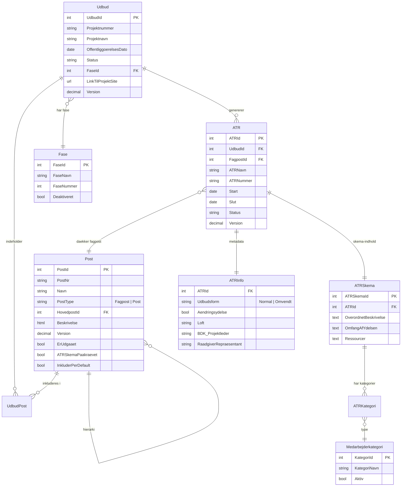

# BaneByg Teknisk Raadgivning (BBTR) — SharePoint-klon

> Udbudsstyring for teknisk raadgivning i Banedanmarks anlaegssektion

## Hvad er BBTR?

BaneByg Teknisk Raadgivning er en SharePoint Online-applikation (SPFx) der bruges til at **udarbejde udbudsmateriale for teknisk raadgivning**. Platformen udvider BBE-konceptet med et fjerde modul — **ATR & Bemanding** — til haandtering af arbejds-, tids- og ressourceskemaer samt bemandingsplaner.

## Platformens 4 sektioner

| Sektion | Formaal | Adgang |
|---------|---------|--------|
| **Poster** | Hierarkisk bibliotek af 25 fagposter (inkl. fasebaserede) med versionerede basistekster | Kun administratorer |
| **Udbud** | Opret og tilpas udbudsdokumenter med faser, poster og bilag | Alle Banebyg-brugere |
| **ATR & Bemanding** | Arbejds-/tids-/ressourceskemaer og bemandingsplaner per fagpost | Alle Banebyg-brugere |
| **Bilag** | Centralt dokumentbibliotek med standardbilag | Kun administratorer |

## Arkitektur

```
┌──────────────────────────────────────────────────────────┐
│                 SharePoint Online (SPO)                   │
│                                                          │
│  ┌─────────┐ ┌─────────┐ ┌──────────────┐ ┌─────────┐  │
│  │ Poster  │ │  Udbud  │ │ATR & Bemand. │ │  Bilag  │  │
│  │ (SPFx)  │ │ (SPFx)  │ │   (SPFx)     │ │ (SPFx)  │  │
│  └────┬────┘ └────┬────┘ └──────┬───────┘ └────┬────┘  │
│       │           │             │               │        │
│  ┌────┴───────────┴─────────────┴───────────────┴─────┐  │
│  │            SharePoint-lister (13 stk.)             │  │
│  │                                                    │  │
│  │  Faelles med BBE (7):                              │  │
│  │  Poster · Bilag · Udbud · UdbudPoster              │  │
│  │  UdbudBilag · Versionslog · BilagFiler             │  │
│  │                                                    │  │
│  │  Unikke for BBTR (6):                              │  │
│  │  ATR · ATRInfo · ATRSkema · ATRKategorier          │  │
│  │  Faser · Medarbejderkategorier                     │  │
│  └────────────────────────────────────────────────────┘  │
└──────────────────────────────────────────────────────────┘
```

## Forskelle fra BBE

BBTR er en **superset** af BBE. Alt i BBE findes ogsaa i BBTR, plus foelgende tilfoejelser og aendringer:

| Dimension | BBE | BBTR |
|-----------|-----|------|
| Sektioner | 3 | **4** (+ ATR & Bemanding) |
| Poster | 17 fagposter | **25** fagposter (inkl. fasebaserede: Programfasen, Projekteringsfase, Udfoerelsefase, Afslutningsfase) |
| Udbud: Stadier | Manuelt definerede stadier | **Erstattet af Fase-felt** (dropdown) |
| Udbud: Delentreprise | Ja | **Nej** (ikke relevant for raadgivning) |
| Post: ATR-skema | Nej | **Ja** (checkbox: "ATR-skema paakraevet") |
| Post: Default inklusion | Nej | **Ja** (checkbox: "Inkluder post per default") |
| Post: Status | Aktiv/Inaktiv dropdown | **Aktiv/Udgaaet toggle switch** |
| Admin: Faser | Nej | **Ja** (opret, rediger, deaktiver faser) |
| Admin: Medarbejderkategorier | Nej | **Ja** (konfigurer kategorier til ATR-skema) |
| Admin: ATR-tekster | Nej | **Ja** (standard ATR- og bemandingstekster) |

## Datamodel



## Poster-hierarki (25 fagposter)

| Nr | Fagpost | Status |
|----|---------|--------|
| 1 | Generelle ydelser | Aktiv |
| 2 | Banebyg | Aktiv |
| 3 | Spor | Aktiv (13 underposter: 3.1–3.13) |
| 4 | Banens underbygning | UDGAAET |
| 5 | Afvanding | UDGAAET |
| 6 | Foeringsveje | Aktiv (3 underposter: 6.1–6.3) |
| 7 | Veje | UDGAAET |
| 8 | Perroner | UDGAAET |
| 9 | Koerstrøm | UDGAAET |
| 10 | Sikling | UDGAAET |
| 11 | Staerkstroem | UDGAAET |
| 12 | Konstruktioner | Aktiv |
| 13 | Miljoe | UDGAAET |
| 14 | Arealer (Fagpakke skabelon) | UDGAAET |
| 15–18 | XXX | UDGAAET |
| 19 | Banebyg | Aktiv |
| 20 | Generelle ydelser | Aktiv |
| 21 | Definitionsfase | UDGAAET |
| 22 | Programfasen | Aktiv |
| 23 | Projekteringsfase | Aktiv |
| 24 | Udfoerelsefase | Aktiv |
| 25 | Afslutningsfase | Aktiv |

## Noeglefunktioner

### Poster (udvidet vs BBE)
- 25 fagposter (inkl. fasebaserede poster 22–25)
- Post-typer: **Fagpost** og **Post** (med Hovedpost-dropdown)
- Aktiv/Udgaaet toggle switch
- Ekstra checkboxes: "ATR-skema paakraevet", "Inkluder post per default"
- Bilag tilknyttes med luk-knap (x)

### Udbud (ændret vs BBE)
- **Fase-felt** (paakraevet dropdown) erstatter manuelt definerede stadier
- Ingen delentreprise-felter
- Poster-editor identisk med BBE (checkbox, udbudsspecifik kommentar, bilag)
- "Hent basistekst fra nyeste version" modal

### ATR & Bemanding (unikt for BBTR)
- **ATR-liste:** Grupperet per udbud med expand/collapse
- **ATR Info:** Udbudsform, AEndringsydelse toggle, kontaktpersoner (BDK Projektleder, Ledelsesrepraesentant, Raadgiver, m.fl.)
- **ATR-skema:** Overordnet beskrivelse, Omfang af ydelsen, Ressourcer, dynamiske kategorier
- **Preview:** ATR-dokument og Bemandingsplan (genererede dokumenter)
- **Import historik:** Vis importerede data

### ATR og Bemandingsindstillinger (Admin)
- **Standard tekster:** 5 sektioner (Hvis ikke andet, Vejledning, Tidsplan, Normal/Omvendt udbudsform)
- **Rediger faser:** CRUD-tabel med sortering, deaktivering og audit-trail
- **Medarbejderkategori admin:** Konfigurer kategorier til ATR-skema

## Roller

| Rolle | Poster | Udbud | ATR & Bemanding | Bilag | Admin |
|-------|--------|-------|-----------------|-------|-------|
| Laeser | Laes | — | — | — | — |
| Bruger | — (kun admin) | Egne | Egne ATR'er | — (kun admin) | — |
| Projektleder | — (kun admin) | Alle aktive | Alle | — (kun admin) | — |
| Administrator | Fuld | Fuld | Fuld | Fuld | Fuld |

> Vigtig forskel: I BBTR kan Poster og Bilag **kun tilgaas af administratorer**.

## Teknisk stack

- **Platform:** SharePoint Online
- **Frontend:** SPFx (SharePoint Framework) + React
- **Datalager:** SharePoint-lister (13 stk.) + dokumentbibliotek
- **Autentifikation:** Azure Active Directory
- **Dokumentgenerering:** Word/Excel udtraek (ATR, Bemandingsplan, Udbudsdokument)
- **Eksterne referencer:** ProjectWise, BIM-systemer (naevnt i basistekster)

## Konfiguration

### SharePoint-lister

**Faelles med BBE (7 lister):**

| Liste | Formaal |
|-------|---------|
| `BaneByg_Poster` | Hierarkiske fagposter (udvidet med BBTR-felter) |
| `BaneByg_Bilag` | Standardbilag-register |
| `BaneByg_Udbud` | Udbuds-stamdata (aendret: +Fase, -Delentreprise) |
| `BaneByg_UdbudPoster` | Poster tilknyttet udbud |
| `BaneByg_UdbudBilag` | Bilag tilknyttet udbud |
| `BaneByg_Versionslog` | AEndringshistorik per udbud |
| `BaneByg_BilagFiler` | Dokumentbibliotek med bilag-filer |

**Unikke for BBTR (6 lister):**

| Liste | Formaal |
|-------|---------|
| `BBTR_ATR` | ATR-registreringer per udbud/fagpost |
| `BBTR_ATRInfo` | ATR-metadata (udbudsform, kontakter) |
| `BBTR_ATRSkema` | ATR-skema indhold (beskrivelse, omfang, ressourcer) |
| `BBTR_ATRKategorier` | Kategorier tilknyttet ATR-skemaer |
| `BBTR_Faser` | Projektfase-definitioner (admin-styret) |
| `BBTR_Medarbejderkategorier` | Medarbejderkategori-register (admin-styret) |

## Kendte begraensninger

Alle BBE-begraensninger gaelder ogsaa for BBTR, plus:

- ATR auto-generering per fagpost ved udbud-oprettelse kraever serverside-logik
- Grupperet ATR-tabel kraever fuld custom SPFx med React gruppering
- Dynamiske kategorier i ATR-skema kraever React state management
- Fase-administration med deaktivering kraever custom SP-liste med soft delete
- Preview ATR / Bemandingsplan kraever Azure Function til dokumentgenerering
- ATR-nummerering (auto-format) kraever beregnet kolonne eller SPFx-logik

## Implementeringsstrategi

> BBE og BBTR boer bygges som **en faelles SPFx-loesning** med feature-flag der aktiverer/deaktiverer ATR-modulet. Det reducerer vedligeholdelse og sikrer konsistens.

```
banebyg-spfx/
  src/
    webparts/
      shared/           # Faelles: Navigation, Forside, PosterListe,
                        #   PostEditor, UdbudListe, UdbudEditor,
                        #   PosterUdbudEditor, BilagListe, Admin
      bbtr-only/        # BBTR-specifikke: ATRListe, ATRInfoModal,
                        #   ATRSkemaEditor, BemandingsIndstillinger,
                        #   FaseAdmin, MedarbejderkategoriAdmin
    config/
      features.ts       # Feature flags: IS_BBTR = true/false
    models/
      shared/           # Post, Bilag, Udbud, UdbudPost, ...
      bbtr/             # ATR, ATRInfo, ATRSkema, Fase, ...
```

## Dokumentation

| Dokument | Beskrivelse |
|----------|-------------|
| [PRD_BBTR_BaneByg_Raadgiver.md](PRD_BBTR_BaneByg_Raadgiver.md) | Fuld PRD med alle skaermbeskrivelser, datamodel, brugerflows og implementeringsplan |
| [PRD_BBE_BaneByg_Entreprise.md](PRD_BBE_BaneByg_Entreprise.md) | BBE PRD (reference for faelles funktionalitet) |

## Kontakt

- **Platform-feedback:** Banebyg@bane.dk
- **SharePoint-support:** ask@bane.dk
